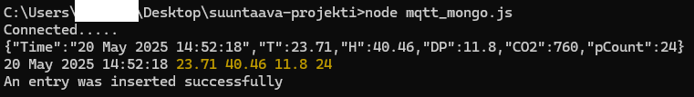
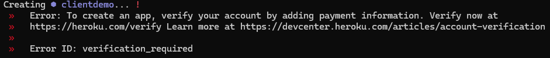

# 🛠️ Automaatioprojekti

Node.js-sovellus, joka muodostaa yhteyden **MQTT-välittäjään** ja tallentaa dataa **MongoDB Atlas** -tietokantaan. Sovellus on ajastettu toimimaan viiden minuutin välein **Herokussa** taustaprosessina (worker) ja tukee **CI/CD-pipelinea GitHub Actionsilla**.

---

## 🧪 Asennus paikallisesti

### 1. Kloonaa repositio

```bash
git clone https://github.com/mii-lai/suuntaava-projekti.git
cd suuntaava-projekti
```

### 2. Asenna riippuvuudet

```bash
npm install
```

### 3. Luo `.env`-tiedosto ja lisää MongoDB-yhteysosoite

```env
MONGODB_URI=mongodb+srv://<käyttäjä>:<salasana>@<klusteri>.mongodb.net/dbname
```

> Älä koskaan lisää `.env`-tiedostoa versionhallintaan!

### 4. Aja sovellus manuaalisesti

```bash
node mqtt_mongo.js
```



---

## 🚀 Deploy Herokuun (taustaprosessina)

Tämä sovellus toimii Herokussa **worker-dynona**, eli ilman web-käyttöliittymää. `Procfile` määrittää suoritettavan komennon:

```procfile
worker: node mqtt_mongo.js
```

### 1. Luo Heroku-sovellus

```bash
git add .
git commit -m "Lisätty Procfile"
heroku login
heroku create example-app
```



### 2. Lisää MongoDB URI Herokun ympäristömuuttujaksi

```bash
heroku config:set MONGODB_URI=mongodb+srv://<käyttäjä>:<salasana>@<klusteri>.mongodb.net/dbname
```

### 3. Pushaa projekti Herokuun

```bash
git push heroku master
```

### 4. Käynnistä worker ja tarkista lokit

```bash
heroku scale worker=1 web=0
heroku logs --tail
```

---

## 🔄 CI/CD (GitHub Actions)

Projektissa on mukana GitHub Actions -workflow, joka:

- Ajaa testit aina kun teet muutoksia
- Julkaisee automaattisesti (esimerkiksi NPM:ään tai Herokuun)

> Workflow löytyy tiedostosta: `.github/workflows/npm-publish.yml`

---

## 🧰 Käytetyt teknologiat

- **Node.js**
- **MQTT**
- **MongoDB Atlas**
- **Heroku (worker dyno)**
- **GitHub Actions (CI/CD)**

---

## 📄 Lisenssi

Tämä projekti on lisensoitu MIT-lisenssillä. Voit käyttää, muokata ja jakaa vapaasti.
